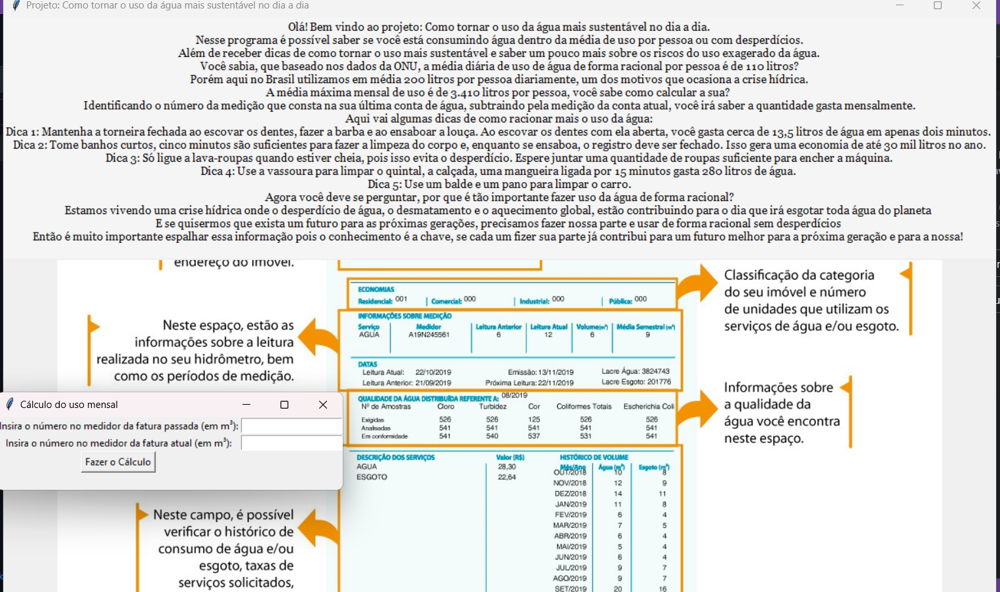

# Projeto Extensionista
# Como tornar o uso da água mais sustentável no dia a dia
## Nesse projeto desenvolvi um software que informa:
#### Os riscos da crise hidríca
#### A importância do uso sustentável
#### Calcula o uso baseado no medidor que consta na conta de água para identificar se está abaixo ou acima do uso máximo diário por pessoa com base nos dados da ONU
#### Dá dicas de como tornar o uso mais sustentável
#### O projeto ainda está em desenvolvimento e ficou assim até o momento: 

